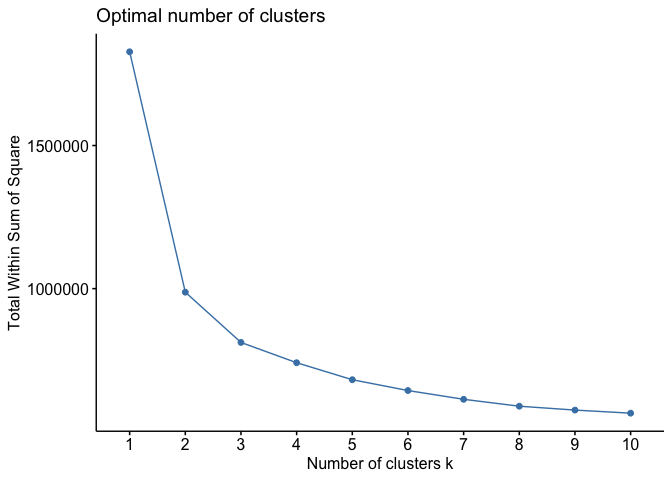

Module 3 Technique Practice
================
Justin Ehringhaus
July 31, 2022

``` r
library(pacman)
p_load(tidyverse)  # usual suite of packages
```

### Introduction

For this assignment, I will be applying two types of clustering (i.e.,
K-means and Hierarchical) and one type of dimensionality reduction
(i.e., principal component analysis, or PCA) to our group’s subset of
the World Values Survey dataset. Clustering is an example of
unsupervised learning, and these techniques can be used 1) to find
homogeneous subgroups within a larger group, 2) to discover patterns in
the features of the data (dimensionality reduction), and/or 3) as
pre-processing step before applying supervised learning techniques.

As a general outline of what is to follow, we will:  
- Prepare the data (feature selection, sampling)  
- Explore the data (descriptive statistics on \# obervations, \#
features)  
- Perform PCA and interpret results  
- Perform two types of clustering and interpret results  
- Combine PCA and clustering  
- Compare and contrast results

### Import, Preparation, and Exploration of the Data

``` r
wvs <- read_csv("/Users/justin/Desktop/ALY 6040/Project/Repo/WVS_Cross-National_Wave_7_csv_v4_0.csv")

# subset of all features our group included in the previous assignment
wvs_subset <- 
  wvs %>% 
  select(
    # --------------------------- DEMOGRAPHICS
    Country = B_COUNTRY_ALPHA,
    Longitude = O1_LONGITUDE,
    Latitude = O2_LATITUDE,
    Settlement.type = H_SETTLEMENT,
    Country.and.year = S025,
    Town.size = G_TOWNSIZE2,
    Age = Q262,
    Income.Group = Q288,
    Ethnic.Group = Q290, # see WVS_codebook.pdf for Q290 coding info
    Immigrant = Q263,
    Religion = Q289,
    Marital.Status = Q273,
    Education = Q275,
    Number.Children = Q274,
    Happiness = Q46,
    Health = Q47,
    # --------------------------- POLITICAL PARTICIPATION / CONFIDENCE IN GOVERNMENT
    votes.locally = Q221,
    votes.nationally = Q222,
    confidence.elections = Q76,
    confidence.courts = Q70,
    confidence.UN = Q83,
    environment.vs.econgrow = Q111,
    # --------------------------- RELATIONSHIP BETWEEN GOVERNMENT AND CITIZENS
    cheating.taxes = Q180,
    gov.video.surveillance = Q196,
    gov.email.monitoring = Q197,
    gov.collecting.info = Q198,
    # --------------------------- ETHICAL VALUES ---------------------------
    terrorism = Q192,
    death.penalty = Q195,
    suicide = Q187,
    beating.wife = Q189,
    beating.children = Q190,
    # --------------------------- SOCIAL VIEWS ---------------------------
    homosexuality = Q182,
    prostitution = Q183,
    abortion = Q184,
    divorce = Q185,
    casual.sex = Q193,
    sex.before.marriage = Q186,
    # --------------------------- CAREER VALUES ---------------------------
    importance.leisure.time = Q3,
    importance.work = Q5,
    # --------------------------- IMMIGRATION ---------------------------
    job.scarc.prioritizes.nonimm = Q34,
    imm.fills.useful.jobs = Q122,
    imm.strengthens.cultural.div = Q123,
    imm.increases.crime.rate = Q124,
    imm.gives.political.asylum = Q125,
    imm.increases.terrorism.risk = Q126,
    imm.helps.poor = Q127,
    imm.increases.unemployment = Q128,
    imm.brings.social.conflict = Q129,
    imm.policy.preference = Q130
    ) %>% 
  # ONLY keeping rows with complete information (no missing values)
  drop_na()

# num. observations
nrow(wvs_subset)
```

    ## [1] 30877

``` r
# num. features
ncol(wvs_subset)
```

    ## [1] 49

In our last assignment, we opted NOT to cleanse missing values from our
dataset, and we supplied justifications for this decision. However, in
this assignment it will be necessary to supply a distance matrix to
clustering algorithms, and such algorithms are not fond of missing
values. Given this, I am opting to include ONLY rows with complete
observations by using the `drop_na` function. The shape of the dataset
is drastically affected, decreasing from 87822 observations to 30877
observations. The number of features will remain the same: 49 features.
Although removing so many observations greatly biases our dataset and is
no longer as representative of world values, this is the simplest
approach for the sake of practicing and understanding the algorithms
under consideration. With further time, I would recommend reducing the
number of features being examined and selectively imputing values for
those features containing missing values.

``` r
# dropping features coded as strings / those that are ordinal rather than nominal
model.data <- 
  wvs_subset %>% 
  select(
    -Country,
    -Longitude,
    -Latitude,
    -Country.and.year,
    -Ethnic.Group
  )

# computational limitations when running models on original dataset
# random sampling to make smaller subset of the data
set.seed(444)
model.data.small <-
  model.data %>%
  sample_n(size = 5000)

# no longer needed, cleaning up space
rm(wvs, wvs_subset, model.data)
```

Prior to continuing, it will be necessary to remove unfavorable features
of our subset as well as to decrease its overall size. Country names,
for instance, are coded as strings, and these cannot be clustered
mathematically unless we were to first convert the strings to numerical
data through a process such as vectorization. Instead, we will drop this
feature as well as any others that are not as important to our analysis
or those coded as strings.

Secondly, I discovered that certain functions such as `dist` (distance
matrix) overwhelmed my computer’s processing capabilities when feeding
in the dataset. Due to this, I have opted to reduce the size of the
dataset through randomly sampling 5,000 obsersations. Keeping prior
versions of the dataset saved in memory also consumed space, and so I
have taken advantage of the very useful `rm` function to clear variables
no longer needed.

------------------------------------------------------------------------

### Performing PCA

``` r
# Check column means to see if scaling is required
colMeans(model.data.small, na.rm = TRUE)
```

    ##              Settlement.type                    Town.size 
    ##                       3.2532                       2.8328 
    ##                          Age                 Income.Group 
    ##                      40.4058                       4.7752 
    ##                    Immigrant                     Religion 
    ##                       1.0488                       3.2058 
    ##               Marital.Status                    Education 
    ##                       2.6344                       3.1764 
    ##              Number.Children                    Happiness 
    ##                       1.8376                       1.7766 
    ##                       Health                votes.locally 
    ##                       2.1658                       1.6092 
    ##             votes.nationally         confidence.elections 
    ##                       1.6466                       2.6374 
    ##            confidence.courts                confidence.UN 
    ##                       2.5210                       2.4936 
    ##      environment.vs.econgrow               cheating.taxes 
    ##                       1.4616                       2.2618 
    ##       gov.video.surveillance         gov.email.monitoring 
    ##                       2.2436                       2.8264 
    ##          gov.collecting.info                    terrorism 
    ##                       2.9198                       1.8724 
    ##                death.penalty                      suicide 
    ##                       3.7254                       2.2578 
    ##                 beating.wife             beating.children 
    ##                       1.8972                       3.1780 
    ##                homosexuality                 prostitution 
    ##                       3.3232                       2.6650 
    ##                     abortion                      divorce 
    ##                       2.9086                       4.4126 
    ##                   casual.sex          sex.before.marriage 
    ##                       3.0028                       3.9676 
    ##      importance.leisure.time              importance.work 
    ##                       1.8074                       1.3738 
    ## job.scarc.prioritizes.nonimm        imm.fills.useful.jobs 
    ##                       2.0826                       1.1730 
    ## imm.strengthens.cultural.div     imm.increases.crime.rate 
    ##                       1.2406                       1.0980 
    ##   imm.gives.political.asylum imm.increases.terrorism.risk 
    ##                       1.1440                       1.1244 
    ##               imm.helps.poor   imm.increases.unemployment 
    ##                       1.3444                       1.1910 
    ##   imm.brings.social.conflict        imm.policy.preference 
    ##                       1.1840                       2.5934

``` r
# Check standard deviations to see if scaling is required
apply(model.data.small, 2, sd, na.rm = TRUE)
```

    ##              Settlement.type                    Town.size 
    ##                    1.4640760                    1.4653578 
    ##                          Age                 Income.Group 
    ##                   15.3127144                    2.1134707 
    ##                    Immigrant                     Religion 
    ##                    0.2154712                    2.5994611 
    ##               Marital.Status                    Education 
    ##                    2.1340214                    1.9581752 
    ##              Number.Children                    Happiness 
    ##                    1.7265638                    0.7400013 
    ##                       Health                votes.locally 
    ##                    0.8761643                    0.8142530 
    ##             votes.nationally         confidence.elections 
    ##                    0.8696319                    0.9529443 
    ##            confidence.courts                confidence.UN 
    ##                    0.9681666                    0.9617401 
    ##      environment.vs.econgrow               cheating.taxes 
    ##                    0.5540639                    2.2016880 
    ##       gov.video.surveillance         gov.email.monitoring 
    ##                    1.1351285                    1.1034974 
    ##          gov.collecting.info                    terrorism 
    ##                    1.0965439                    1.8702989 
    ##                death.penalty                      suicide 
    ##                    3.1482657                    2.2335481 
    ##                 beating.wife             beating.children 
    ##                    1.9647402                    2.7872333 
    ##                homosexuality                 prostitution 
    ##                    3.0379249                    2.4551131 
    ##                     abortion                      divorce 
    ##                    2.6852352                    3.1884157 
    ##                   casual.sex          sex.before.marriage 
    ##                    2.7497462                    3.2075860 
    ##      importance.leisure.time              importance.work 
    ##                    0.8035138                    0.6658545 
    ## job.scarc.prioritizes.nonimm        imm.fills.useful.jobs 
    ##                    1.1021888                    0.8831914 
    ## imm.strengthens.cultural.div     imm.increases.crime.rate 
    ##                    0.8847984                    0.9034153 
    ##   imm.gives.political.asylum imm.increases.terrorism.risk 
    ##                    0.8853365                    0.9081242 
    ##               imm.helps.poor   imm.increases.unemployment 
    ##                    0.8437601                    0.9034834 
    ##   imm.brings.social.conflict        imm.policy.preference 
    ##                    0.8974994                    0.8083360

As a final step prior to performing PCA, I will check the mean values
and standard deviations of each column. This is useful for understanding
whether or not the values of features in our dataset are on the same, or
different, scales. Having previously explored the dataset, I know
already the features are on different scales, and thus scaling will be
necessary, but the above functions demonstrate a simple way of assessing
the uniformity of features in a dataset.

``` r
wvs.pr <- prcomp(
  ~ .,
  data = model.data.small,
  scale. = TRUE
  )

# summary(wvs.pr) shows that 25 principal components required to explain 80% of the variance of the data
summary(wvs.pr)
```

    ## Importance of components:
    ##                           PC1     PC2     PC3     PC4     PC5     PC6     PC7
    ## Standard deviation     2.3415 1.80725 1.60516 1.48009 1.42945 1.31392 1.23255
    ## Proportion of Variance 0.1246 0.07423 0.05856 0.04979 0.04644 0.03924 0.03453
    ## Cumulative Proportion  0.1246 0.19884 0.25740 0.30719 0.35363 0.39286 0.42739
    ##                            PC8     PC9    PC10   PC11    PC12    PC13    PC14
    ## Standard deviation     1.15830 1.14361 1.12548 1.0675 1.03662 1.00176 0.96623
    ## Proportion of Variance 0.03049 0.02972 0.02879 0.0259 0.02442 0.02281 0.02122
    ## Cumulative Proportion  0.45788 0.48760 0.51639 0.5423 0.56671 0.58952 0.61074
    ##                           PC15    PC16    PC17    PC18    PC19    PC20    PC21
    ## Standard deviation     0.95533 0.93432 0.92989 0.90659 0.88794 0.87426 0.85906
    ## Proportion of Variance 0.02074 0.01984 0.01965 0.01868 0.01792 0.01737 0.01677
    ## Cumulative Proportion  0.63148 0.65132 0.67097 0.68965 0.70757 0.72494 0.74172
    ##                           PC22    PC23    PC24   PC25    PC26    PC27    PC28
    ## Standard deviation     0.84973 0.84207 0.82767 0.8041 0.79544 0.78667 0.76606
    ## Proportion of Variance 0.01641 0.01612 0.01557 0.0147 0.01438 0.01406 0.01334
    ## Cumulative Proportion  0.75813 0.77424 0.78981 0.8045 0.81889 0.83295 0.84629
    ##                           PC29    PC30   PC31    PC32    PC33    PC34    PC35
    ## Standard deviation     0.76098 0.75656 0.7445 0.72747 0.68725 0.68162 0.66628
    ## Proportion of Variance 0.01316 0.01301 0.0126 0.01203 0.01073 0.01056 0.01009
    ## Cumulative Proportion  0.85945 0.87246 0.8851 0.89709 0.90782 0.91838 0.92847
    ##                           PC36    PC37    PC38    PC39    PC40    PC41    PC42
    ## Standard deviation     0.66262 0.64812 0.63745 0.61921 0.60772 0.56376 0.55141
    ## Proportion of Variance 0.00998 0.00955 0.00924 0.00871 0.00839 0.00722 0.00691
    ## Cumulative Proportion  0.93845 0.94799 0.95723 0.96594 0.97434 0.98156 0.98847
    ##                           PC43    PC44
    ## Standard deviation     0.54609 0.45726
    ## Proportion of Variance 0.00678 0.00475
    ## Cumulative Proportion  0.99525 1.00000

We can feed our dataset into the `prcomp` function, including all
variables and setting `scale. = TRUE` as the features are on different
scales, as demonstrated above. The summary reveals the proportion of
variance each principle component explains, as well as a cumulative
total. Depending on the particular problem at hand, at a later stage we
may choose to prune the model to include principle components only up to
a certain point. For example, if we want to reduce dimensionality but
also retain information, PCA informs us it takes at least 25 principle
components to explain at least 80% of the variance in the data, and thus
pruning and visualizing a model is a balancing act of determining
dimensionality and information retention. Ideally, few dimensions will
explain the majority of variance in the data, but as exemplified above
this is not always the case.

``` r
biplot(wvs.pr)
```

<!-- -->

The above biplot demonstrates how a non-trivial number of observations
and features can make it difficult to determine the relationships of
features to one another. The first two principle components explain only
20% of the variance, and it is only possible to make several
interpretations given the density of component scores and loadings such
as “beating.wifi” and “terrorism” features sharing the same
directionality, which signifies a strong relationship between the two
features. As such, future attempts at PCA would benefit by reducing the
number of features included in the analysis in order to discern more
accurately the relationships between each.

``` r
# 1 x 2 grid
par(mfrow = c(1, 2))

# variability of each feature
pr.var <- wvs.pr$sdev ^ 2

# Variance explained by each principal component
pve <- pr.var / sum(pr.var)

# variance explained for each principal component
plot(pve, xlab = "Principal Component", 
     ylab = "Proportion of Variance Explained", 
     ylim = c(0, 1), type = "b")

# cumulative proportion of variance explained
plot(cumsum(pve), xlab = "Principal Component", 
     ylab = "Cumulative Proportion of Variance Explained", 
     ylim = c(0, 1), type = "b")
```

<!-- -->

As previously discussed, PCA provides information as to the relative
importance of each feature. The above plots visualize the variance
explained by each principle component, individually (left) and
cumulatively (right). The above code is written in base R, but a more
succinct version with more easily interpretable results is included
below, which is generated using the factoextra package.

``` r
p_load(factoextra)

# another method for finding optimal number of clusters with elbow method
fviz_nbclust(model.data.small, kmeans, method = "wss")
```

<!-- -->

I will refer to these charts at a later step when using the “elbow
method” for determining the optimal number of clusters to include in
clustering models when pruning them.

### Hierarchical Clustering

``` r
# scaling
data.scaled <- scale(model.data.small)

# calculating Euclidean distances
data.dist <- dist(data.scaled, method = "euclidian")

# no longer needed
rm(data.scaled)
```

Prior to feeding the dataset into a hierarchical clustering model, it is
necessary both to scale it and to calculate a distance matrix using the
scaled version.

``` r
# creating hierarchical clustering model
wvs.hclust <- hclust(data.dist, method = "complete")
```

The above code builds a hierarchical clustering model, where
`method = "complete"` generally tends to produce the most balanced
results. `method = "single"` can produce unbalanced trees, however this
may sometimes be preferred if your intent is to explore outlier
clusters. A balanced tree, on the other hand, is optimal for producing
clusters approximately equal in size.

``` r
# dendogram
plot(wvs.hclust)
abline(h = 17, col = "red")
```

<!-- -->

The dendogram above reveals helpful information for pruning or cutting
the tree. For example, you can choose to cut a tree at a certain height
(h) or with a certain number of groups (k). The “elbow method” mentioned
above entails choosing the optimal number of clusters, and it appears
the elbow occurs at either two or three. In the dendogram, including a
red horizontal line at the height of 17 shows the tree would be cut into
three clusters at this height. We know from our PCA above that three
clusters or principle components explain 25.7% of the variance in the
data. This is not much, so we will lose information, but on the other
hand we can more easily visualize the results of clustering.

``` r
wvs.hclust.clusters <- cutree(wvs.hclust, k = 3)
```

The above code uses `k = 3` to define the number of clusters we would
like to include in our hierarchical clustering model. The other option
would be to declare `h = 17` to choose the height at which to cut the
tree where three clusters remain.

``` r
# observing cluster membership
table(wvs.hclust.clusters)
```

    ## wvs.hclust.clusters
    ##    1    2    3 
    ## 1262 3548  190

The contingency table of the hierarchical clustering model shows the
clusters are not balanced, with the majority contained within the second
cluster and a minority in the third cluster.

------------------------------------------------------------------------

### K-means Clustering

``` r
# creating a k-means model
wvs.km <- kmeans(
  scale(model.data.small),
  centers = 3,
  nstart = 20
)
```

Unlike hierarchical clustering, k-means clustering requires knowing at
the outset the number of clusters to create. As we have already
conducted a principle component analysis and hierarchical clustering, we
will similarly refer to the “elbow method” and choose three clusters for
modeling purposes.

There is a random component to k-means clustering, where the algorithm
initially chooses at random *k* observations of each future to include
for calculation of its initial center. Because of the random component,
`nstart` defines the number of times to re-run the k-means algorithm for
the purpose of selecting the best model out of all of them.

``` r
# observing cluster membership
table(wvs.km$cluster)
```

    ## 
    ##    1    2    3 
    ## 1435 2091 1474

Unlike the hierarchical clustering model, the k-means model produced
more balanced clusters. Similarly, the second cluster contains the
majority.

``` r
fviz_cluster(wvs.km, data = model.data.small)
```

<!-- -->

Visualizing the clusters from the above k-means model reveals there is
some overlap in each, but the model generally does a good job at
partitioning the clusters.

------------------------------------------------------------------------

### Combining PCA and clustering

``` r
# PC1:PC5 explain over 35% variance in the data
wvs.pr.hclust <- hclust(dist(wvs.pr$x[, 1:5]), method = "complete")

# cutting model into 3 clusters
wvs.pr.hclust.clusters <- cutree(wvs.pr.hclust, k = 3)
```

Having performed PCA, we can combine our knowledge of principle
components with hierarchical clustering to produce a new model including
only certain principle components explaining a certain amount of
variance in the data. For example, we know that five principle
components explain 35% of the variance in the data, so we can create a
new hierarchical clustering model containing only these, and then prune
the resulting tree into three clusters as before.

------------------------------------------------------------------------

### Comparisons

``` r
table(wvs.hclust.clusters, wvs.pr.hclust.clusters)
```

    ##                    wvs.pr.hclust.clusters
    ## wvs.hclust.clusters    1    2    3
    ##                   1  333  916   13
    ##                   2 2301 1223   24
    ##                   3   37   39  114

Comparing the previous hierarchical clustering model to the pruned
hierarchical clustering model, we can see using the above contingency
table that cluster 2 contains the most overlap, and the previous model’s
second cluster is most equivalent to the pruned model’s first cluster.

``` r
# comparing k-means to hierarchical clustering
table(wvs.km.clusters = wvs.km$cluster, wvs.hclust.clusters)
```

    ##                wvs.hclust.clusters
    ## wvs.km.clusters    1    2    3
    ##               1   95 1337    3
    ##               2  416 1669    6
    ##               3  751  542  181

Comparing the k-means clustering model to the original hierarchical
clustering model, it looks like the second cluster from each are the
most equivalent, whereas the third cluster is most dissimilar.

------------------------------------------------------------------------

### Conclusions

The one type of dimensionality reduction (PCA) and the two types of
clustering (k-means and hierarchical) employed in this assignment
represent just a first step in exploring the relationships between
features in a dataset as well as how those features can be partitioned.
As clustering is an example of unsupervised learning, we are still left
with the task of interpreting what those clusters mean.

For instance, although I had used the “elbow method” to choose three
clusters as the optimal number, clustering alone did not provide me with
any information as to what those clusters represent. The next step in
the data mining pipeline might be to explore the clusters more
thoroughly to understand how to label them. Having done so, we would
walk away with a deeper understanding of how the dataset is grouped.

Another option would be to label the clusters in order to conduct
supervised learning and make predictions using train and test sets.
Then, new data fed into a supervised learning model could be predicted
to belong to a certain cluster.

------------------------------------------------------------------------

### Works Cited:

<div id="refs" class="references csl-bib-body hanging-indent">

<div id="ref-datacamp" class="csl-entry">

Roark, Hank. n.d. “Unsupervised Learning in r.”
<https://app.datacamp.com/learn/courses/unsupervised-learning-in-r>.

</div>

</div>
